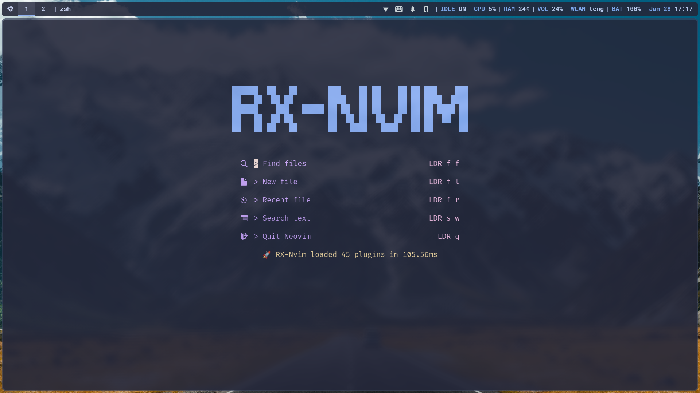

<h1 align = "center">🚀RX-Nvim</h1>

<p align = "center">RX-Nvim is a custom neovim config that use lazy.vim</p>

<p align = "center">
  <a href = "https://neovim.io/">
    
  </a>
</p>

## 🌟 Preview



## ✨ Features

#### CORE

- Plugin manager with [lazy](https://github.com/folke/lazy.nvim)

#### UI

- Startup with [alpha](https://github.com/goolord/alpha-nvim)
- Statusline with [lualine](https://github.com/nvim-lualine/lualine.nvim)
- Tabline with [bufferline](https://github.com/akinsho/bufferline.nvim)
- File explorer with [neo-tree](https://github.com/nvim-neo-tree/neo-tree.nvim)
- Notification manager with [notify](https://github.com/rcarriga/nvim-notify)
- Colorscheme with [catppuccin](https://github.com/catppuccin/nvim)

#### EDITOR

- Autopairs with [autopairs](https://github.com/windwp/nvim-autopairs)
- Color highlighter with [colorizer](https://github.com/NvChad/nvim-colorizer.lua)
- Git integration with [gitsigns](https://github.com/lewis6991/gitsigns.nvim)
- Highlight the word with [illuminate](https://github.com/RRethy/vim-illuminate)
- Indentline with [indent-blankline](https://github.com/lukas-reineke/indent-blankline.nvim)
- Move around with [leap](https://github.com/ggandor/leap.nvim)
- Split resizing and navigation with [smart-splits](https://github.com/mrjones2014/smart-splits.nvim)
- Surround selections with [surround](https://github.com/kylechui/nvim-surround)
- Fuzzy finder with [telescope](https://github.com/nvim-telescope/telescope.nvim)
- Todo comments with [todo-comments](https://github.com/folke/todo-comments.nvim)
- Terminal with [toggleterm](https://github.com/akinsho/toggleterm.nvim)
- Key bindings with [which-key](https://github.com/folke/which-key.nvim)

#### CODING

- Completion with [CMP](https://github.com/hrsh7th/nvim-cmp)
- Comments with [Comment](https://github.com/numToStr/Comment.nvim)
- Snippet engine with [LuaSnip](https://github.com/L3MON4D3/LuaSnip)
- Markdown preview with [markdown-preview](https://github.com/iamcco/markdown-preview.nvim)
- Syntax with [treesitter](https://github.com/nvim-treesitter/nvim-treesitter)
- LSP installer with [mason](https://github.com/williamboman/mason.nvim)
- Inject LSP features with [null-ls](https://github.com/jose-elias-alvarez/null-ls.nvim)

## ⚡ Requirements

- Neovim >= 0.8.2
- Git >= 2.39.0
- [Nerd Font](https://github.com/ryanoasis/nerd-fonts)(_optional_) require for telescope
- [Ripgrep](https://github.com/BurntSushi/ripgrep)(_optional_) require for telescope
- [fd](https://github.com/sharkdp/fd)(_optional_) require for telescope
- [nixpkgs](https://github.com/nix-community/nixpkgs-fmt)(_optional_) require for NixOS user

## 🛠 Installation

### FHS linux

Make a backup of your current neovim config

```shell
mv ~/.config/nvim ~/.config/nvim.bak
```

Clone this repository

```shell
git clone https://github.com/CnTeng/RX-Nvim.git ~/.config/nvim
```

### NixOS

Clone this repository to your NixOS config

```shell
git clone https://github.com/CnTeng/RX-Nvim.git ~/anywhere you want
```

Add this config to your NixOS config

```nix
{
  # Require for Telescope man_pages
  documentation.man.generateCaches = true;

  home-manager.users.${user} = {
    home.packages = with pkgs; [
      # Require for telescope(optional)
      ripgrep
      fd
      tree-sitter
      # Require for nix format(optional)
      nixpkgs-fmt
    ];

    home.sessionVariables = {
      # Require for marksman
      DOTNET_SYSTEM_GLOBALIZATION_INVARIANT = 1;
    };

    programs.neovim = {
      enable = true;
      defaultEditor = true;
      withNodeJs = true;
      extraPython3Packages = ps: with ps; [
        pip
      ];
    };

    xdg.configFile."nvim" = {
      source = ./nvim;
      recursive = true;
    };
  };
}
```

Also, you can use [FHS linux installation guide](#fhs-linux)

## ⭐ Credits

- [AstroNvim](https://github.com/AstroNvim/AstroNvim)
- [LazyVim](https://github.com/LazyVim/LazyVim)
- [nvimrc](https://github.com/XXiaoA/nvimrc)
